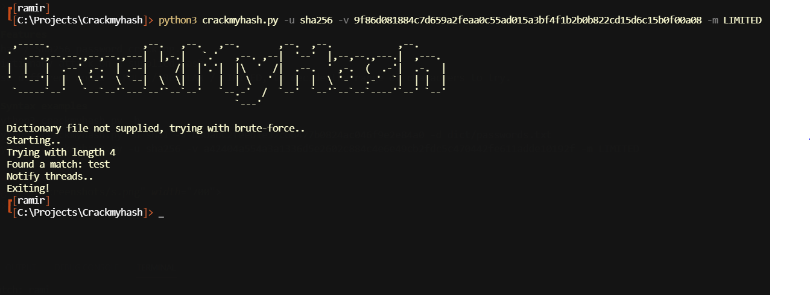

# CrackMyHash
## Multi-threaded brute-force application for cracking password hashes.

<p align="center">

</p>

## Features 
- Sha1 / Sha256 password cracking.
- Dictionary attack on a supplied hash.
- Use different modes - FULL / REGULAR / LIMITED, to decide the range of characters to try.
- Specify value length to work with in order to limit the search time.

## Syntax examples
```
- options:
  -h, --help            show this help message and exit
  -m MODE, --mode MODE  FULL (slow) / REGULAR (default) / LIMITED (quick)
  -u USE_HASH, --use-hash USE_HASH
                        sha1 / sha256
  -v VALUE, --value VALUE
                        ed1706c82c77b99e4276522967f7563fa7cd8f2d
  -d DICTIONARY, --dictionary DICTIONARY
                        dict/passowrds.txt
  --min MIN             Minimum length to start with
  --max MAX             Maximum length to try
  --verbose             Show outputs

- python3 crackmyhash.py -h
- python3 crackmyhash.py -u sha1 -v b80abc2feeb1e37c66477b0824ac046f9e2e84a0 -d dict/passwords.txt
- python3 crackmyhash.py -u sha1 -v d0f9071a4c9f11a750a6632b7a3c2fd602e44515 -m LIMITED --verbose --min 4 --max 5
- python3 crackmyhash.py -u sha256 -v a42404a554a3a1336d5e2602c884c4e6e49cb2fdc5c470442fe611adde10192f -m LIMITED
```

<p align="center">

</p>
